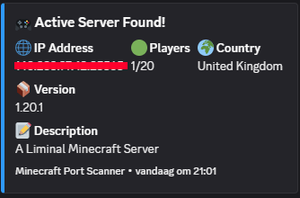

# Minecraft Hidden SMP Scanner ⛏️

<div align="center">
<strong>🌍 Visit hidden SMPs all around the world! 🌍</strong>
</div>

---

A high-performance async Rust tool that scans for Minecraft servers across the internet. Uncover hidden communities and explore unknown servers.


## Features

- **Fast Scanning**: Multi-threaded async scanning with configurable concurrency
- **Discord Integration**: Automatically notifies Discord channels when servers are found
- **Version Filtering**: Categorizes servers by Minecraft version 
- **Player Status**: Distinguishes between active servers (with players) and empty servers
- **GeoLocation**: Shows server country

---

<div align="center">

<br>
🔔 Discord Integration
</div>

## Configuration

Edit `config.toml` to customize:
- Scanning parameters (threads, timeouts, port ranges)
- Discord webhook URLs for different server categories
- Target IP subnets in `assets/ips.txt`

### IP Range Format

The `assets/ips.txt` file should contain CIDR notation IP ranges, one per line:
```
95.217.0.0/16
88.99.0.0/16
5.9.0.0/16
```

## Usage

```bash
cargo run --release
```

> [!WARNING]
> This tool is created for educational purposes and legitimate network research only. Do not abuse this software for malicious purposes. Be responsible and ethical in your usage.

